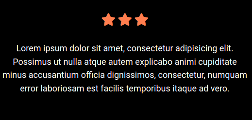

# Vanilla JS & CSS Star Rating Animation

A simple yet powerful plugin for displaying animated star ratings and customer reviews on your website. Built with pure JavaScript and CSS, this project is lightweight, customizable, and easy to integrate into any web page. Perfect for showcasing client feedback in a visually appealing way!

This project was created out of passion for coding and can be easily adapted to suit various design needs. Feel free to explore the code, customize it as you wish, and use it on your own projects.

